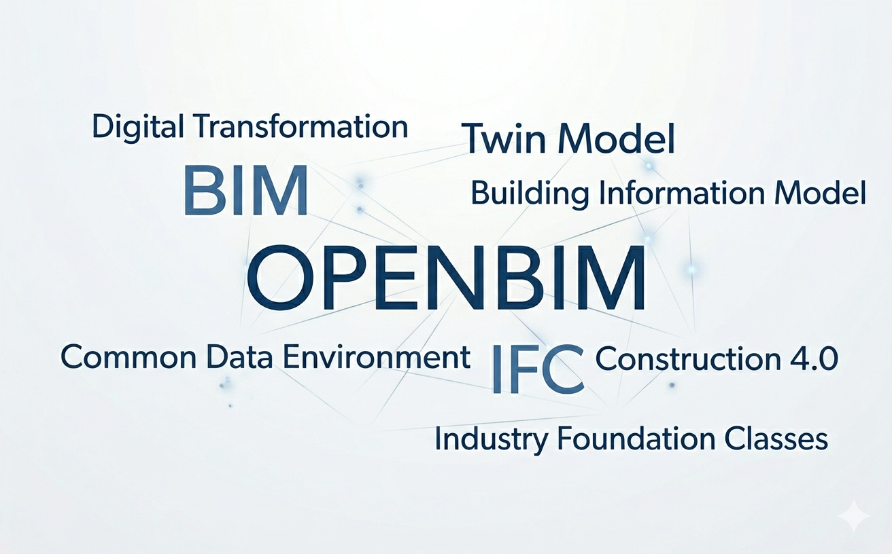
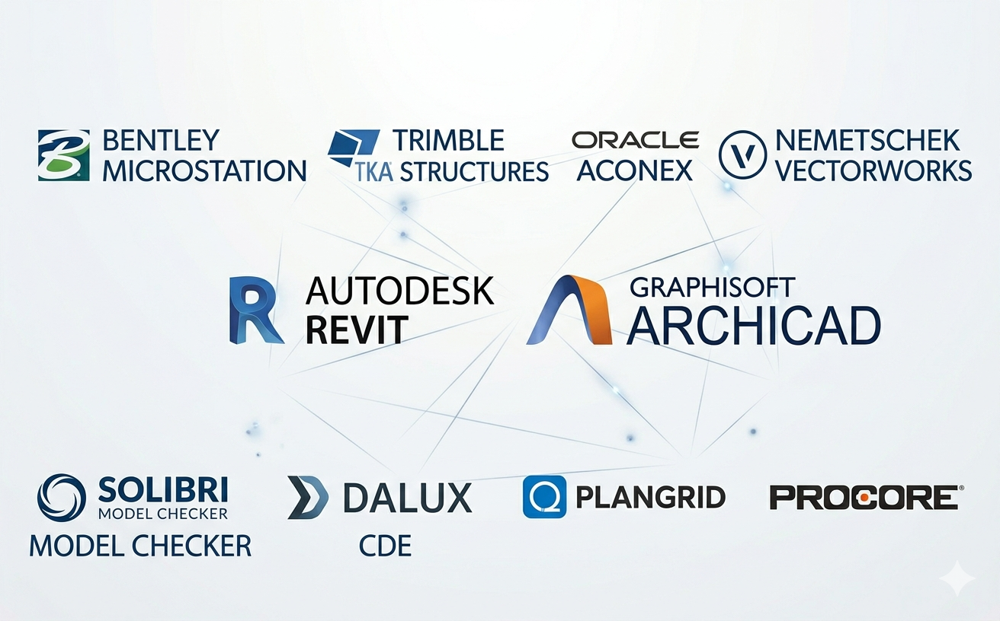
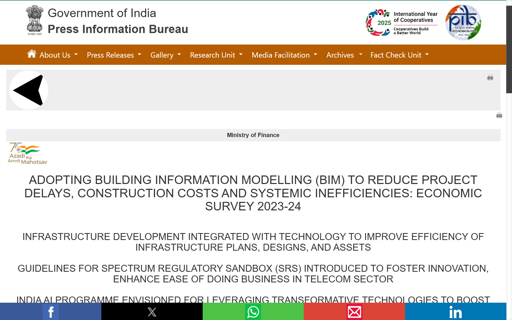
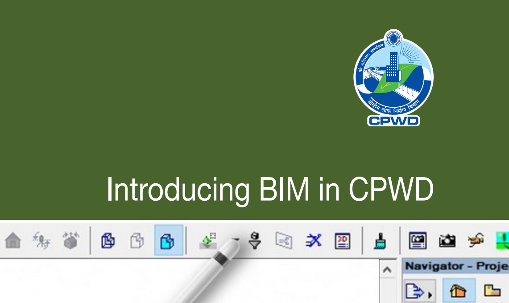
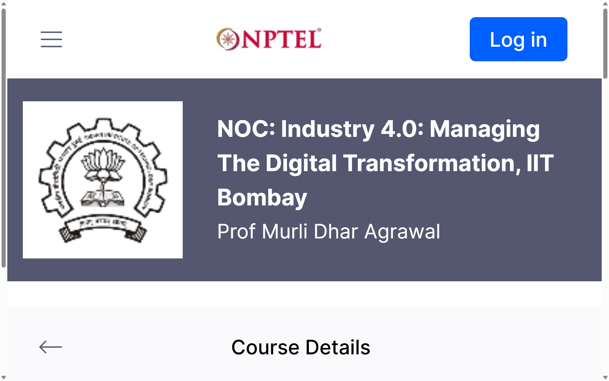
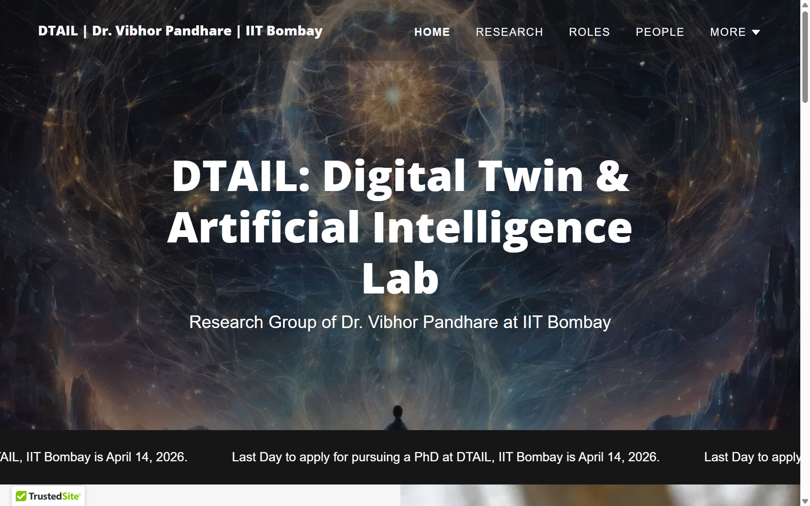

<h1 style="font-size: 5em;">Construction 4.0 and Digital Collaboration</h1>

---

<!--

-->

---

# 1. ISO 19650-1,"Organization and digitization of information about buildings and civil engineering works, including BIM — Information management using BIM — Part 1: Concepts and principles",2018,2018,2018
# 1. ISO 19650-2,"Organization and digitization of information about buildings and civil engineering works, including BIM — Information management using BIM — Part 2: Delivery phase of the assets",2020,2018 (series),2018
# 1. ISO 19650-3,"Organization and digitization of information about buildings and civil engineering works, including BIM — Information management using BIM — Part 3: Operational phase of the assets",2020,2020,2018
# 1. ISO 19650-4,"Organization and digitization of information about buildings and civil engineering works, including BIM — Information management using BIM — Part 4: Information exchange",2022,2022,2018
# 1. ISO 19650-5,"Organization and digitization of information about buildings and civil engineering works, including BIM — Information management using BIM — Part 5: Security-minded approach",2020,2020,2018
# 1. ISO 19650-6,"Organization and digitization of information about buildings and civil engineering works, including BIM — Information management using BIM — Part 6: Health and safety information",2025,2025,2018
# 1. ISO 29481-1,Building information modelling — Information delivery manual (IDM) — Part 1: Methodology and format,2016,2016-05,2010
# 1. ISO 29481-2,Building information modelling — Information delivery manual (IDM) — Part 2: Interaction matrix,2012,2012,2012
# 1. ISO 12006-2,Building construction — Organization of information about construction works by use of building information modelling (BIM) — Part 2: Framework for classification,2020,2020,1999 (Part 2 first)
# 1. ISO 16739-1,Industry Foundation Classes (IFC) for data sharing in the construction and facility management industries — Part 1: Data schema (IFC4.3),2024,2024 (IFC 4.3),1994 (STEP base)
# 1. ISO 23386,Building information modelling (BIM) — Information containers for data sharing and exchange — Part 1: Components,2020,2020,2020
# 1. ISO 23387,Building information modelling (BIM) — Information containers for data sharing and exchange — Part 2: Delivery view and trust centre model,2020 (revised 2024),2024,2020
# 1. ISO 55000,"Asset management — Overview, principles and terminology",2024,2024,2014
# 1. ISO 10303,Industrial automation systems and integration — Product data representation and exchange (STEP),Ongoing (multiple parts),1994 (first),1994
# 1. ISO 19657,Building information modelling (BIM) — Level of information (LOI) needed in the project delivery — Concept and definition,2021,2021,2021
# 1. CPWD BIM Guide,Introducing BIM in CPWD,1st Edition,2024-07,2024
# 1. NITI Aayog BIM,Sectoral Insights: Buildings (BIM recommendations),N/A,2026-02,2026

---

## A. Curriculum Integration

* BIM Fundamentals & Authoring
* OpenBIM & Interoperability
* 4D/5D BIM
* Scan-to-BIM
* Digital Twin Concepts

## B. Laboratory Development

* Establish a BIM & Digital Twin Lab

# Research

## A. OpenBIM & Interoperability
## B. Digital Twin Research
## C. Construction Automation & AI
## D. Sustainability & Lifecycle Analysis

# Consultancy & Industry Collaboration

## A. BIM Implementation Services
## B. OpenBIM Advisory
## C. Digital Twin Deployment
## D. Government & Policy Support
## E. Training & Capacity Building
