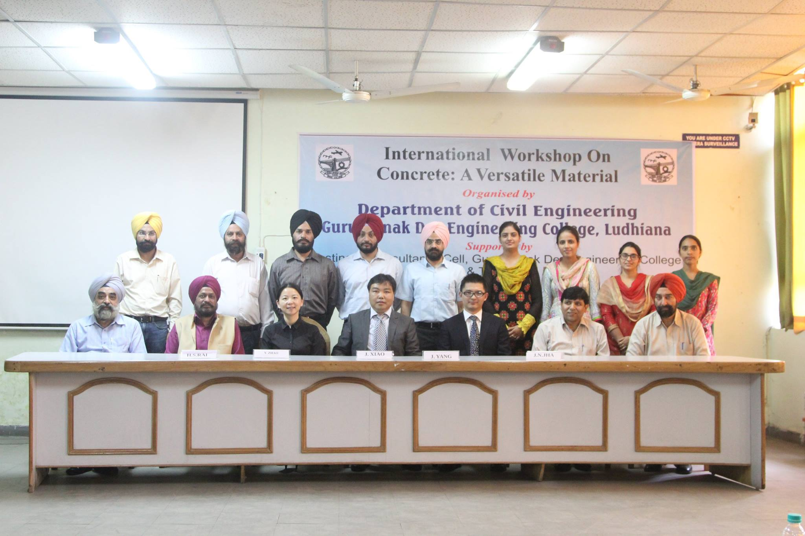

# The Blueprint for Excellence: A Journey in Civil Engineering

Prof. (Dr.) H S Rai

## What is "Excellence"?
It's not a single achievement or a final destination.

- A Mindset: The relentless pursuit of higher standards.
- A Process: A commitment to continuous learning and improvement.
- An Action: The application of skill and integrity to create something of lasting value.

## Excellence in Civil Engineering

It's the art of blending science and creativity to build a world that is:

- Technically Sound: Safe, durable, and resilient.
- Innovative: Pushing the boundaries of design and technology.
- Sustainable: Respecting our planet and its resources.
- Human-Centric: Enhancing communities and the quality of life.

## The Student's Journey Begins

Your Role in Forging Excellence:

Excellence isn't given; it's built. Your graduation journey is the time to lay the foundation.

- Your Duty 1: Master the Fundamentals
    - Go Beyond the Textbook: Don't just memorise formulae. Understand the "why" behind them. Question everything.
    - Connect the Dots: See how Geotechnical Engineering impacts Structural Design. See how Fluid Mechanics applies to Transportation.
    - Embrace the Core Sciences: Your strength in math and physics is the bedrock of your engineering intuition.
- Your Duty 2: Get Your Hands Dirty
    - Seek Internships Actively: Real-world experience is non-negotiable. It's where theory meets reality.
    - Join Student Competitions: Events like the Cubethon, Steel Bridge or Concrete Canoe competitions build practical teamwork and problem-solving skills.
    - Build Your Digital Toolkit: Become proficient in essential software like BIM (FreeCAD), GIS (GRASS), Vibe-Coding.
- Your Duty 3: Cultivate a Professional Mindset
    - Develop Communication Skills: Learn to write clear reports and present your ideas confidently.
    - Uphold Unwavering Ethics: Understand that your primary responsibility is to the public's safety and welfare.
    - Become a Lifelong Learner: The field is always evolving. Your learning doesn't stop at graduation.

## The Guide on the Side
The Role of Your Faculty

You don't walk this path alone. Your faculty are your most valuable resource, acting as:
- guides, 
- mentors, and 
- bridges to your future career.

## How Your Faculty Empowers You

- As Master Educators: They teach you how to think like an engineer.
- As Bridges to the Profession: They connect you to internships, guest speakers, and industry networks.
- As Mentors and Guides: They offer personalised career advice and help you build confidence.
- As Keepers of Ethics: They instill the profound responsibility that comes with being a civil engineer.

## The Takeaway: Your Blueprint

- Excellence is a continuous journey, not a destination.
- Own your education: Actively blend theory with hands-on practice.
- Leverage your resources: Your faculty are your guides and mentors.
- Build with Integrity: Your ultimate goal is to create a safer, more sustainable, and better world.

# Thank You

