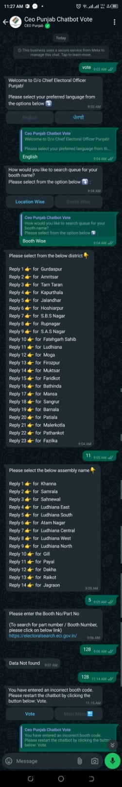

Extension of my post [on LinkedIn](https://www.linkedin.com/posts/hsrai_help-that-wont-help-election-commission-activity-7202524240498089984-cxiK?utm_source=share&utm_medium=member_desktop)

## Help that won't help

The Election commission tries a lot to make the voter's experience delightful, and launches apps / services in that direction. But poor execution proves it otherwise.

I (and I am sure many more) wasted time by using https://lnkd.in/gMG3zfMu to know the queue at the polling booth from the comfort of home, on getting the message "No data found for the selected AC Details and Part Details." in place of the actual number of voters in queue.

Also found another similar service, hence duplicate effort, at:

[Voter's queue on WhatsApp](https://lnkd.in/gY37Xb_H)

with heading:

> Voters can check length of queues at polling booths from home: Punjab CEO

Information Technology was supposed to bring efficiency and optimise resource utilisation, but such things reflect duplicate efforts with wastage of user's time.

What should we or the Government do?

### Review of WhatApp Chatbot

This is discrimination with users who don't use WhatsApp. Can Governments create barriers for it's citizens that they need to use a particular app (WhatsApp in this case)? 

Fail to understand why the Government is promoting a particular app. Users not using WhatsApp have no way to know the queue. Thanks to non-functioning of the app, which made both users and non-users of WhatsApp at par, rather non-whatsapp users saved their time by not trying it ;-) 

My review (as a user) of non-functional app (as you don't get desired information) is:

Start conversation with message:

```
vote
```

then select language.

The you get two options:

```
How would you like to search queue for your booth name?

Please select from the option below ⤵️ :

[Location Wise] [Booth Wise]
```

Unable to get, why location wise. If a person is on location, then he will see the queue physically, why will he use the app then? Might be to test the accuracy of information.

On selecting [Booth Wise], then you need to go through a list of 23 districts (names are in random order, to make it a puzzle for the user), and enter a number corresponding to the district where you need to vote.

Then you are presented with a list of 14 assembly names (again random order, Oh! My God, where are good front-end developers?). On entering the number corresponding to where you need to vote, you are asked to:

```
Please enter the Booth No/Part No

(To search for part number / Booth Number, please click on below link)

https://electoralsearch.eci.gov.in/
```
If you know the booth number or could find from the above link, enter that as requested to get:

```
Data Not found
```

If I wish to know the status (say after 30 minutes or so), I need to repeat this whole process, there is no short-cut. Good way to keep citizens engaged in non-productive work (kill the time).

May enjoy the interaction, captured in loooong screenshot:


