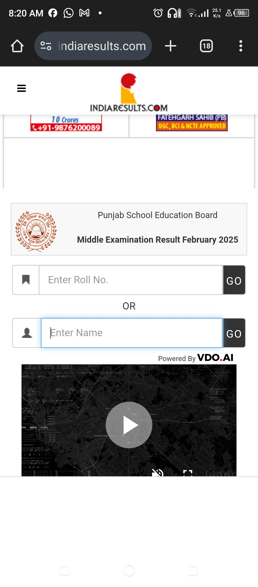

# Result by Education Board, Responsibility and the Risks of Re(Mis)direction

On April 4th, 2025, the Punjab School Education Board (PSEB) declared the results for Class 8. Among the many nervous students waiting for their scores was a young girl who has been receiving tutoring from my wife — a quiet but powerful act of philanthropy she undertook to help children, in the neighourhood, to succeed in their studies.

This wasn’t a one-time gesture. My wife has been teaching many more such students regularly, purely as a social responsibility, with no expectations, fees, or recognition. Her motivation? Just to make a difference.

But that afternoon, the student reached out in distress — she couldn’t access her result online.

## The "Official" Path to Confusion

My wife tried to help, but ran into the same issue. That’s when she turned to me.

I began by visiting the official website of PSEB: 
[https://www.pseb.ac.in/](https://www.pseb.ac.in/) 
It had the Punjab Government logo and "https" in the URL. I don't see anything wrong with the URL to consider the site suspicious. It was a genuine government website.

On the homepage, I found this link:

**Middle Examination Result February 2025 AVAILABLE**

Clicking on it redirected me silently to another URL: 
[https://punjab.indiaresults.com/pseb/default.htm](https://punjab.indiaresults.com/pseb/default.htm) 
—a third-party website run by Charu Mindworks (India) Pvt. Ltd.

> Most users would still believe they're on a government site. 
> There's no notification or consent before redirecting to this private platform.

## A Mobile UX Nightmare

On mobile, the redirected page was nearly unusable:

1. Poor design
2. Text hard to read without zooming. See the zoomed content in the screenshot below:

The link labeled **"AVAILABLE"** didn’t even work when tapped / clicked.

I tried again on a laptop. The same issue occurred.

Eventually — almost accidentally — I clicked the black text before the red "AVAILABLE", while I was clicking again and again while staring the screen; and a new page opened. But before I could read anything, an ad covered the screen.

  

3. Multiple banner and popup ads

I clicked the tiny [X], only to be led to a webform surrounded by more ads (just notice the advertisements in the screenshot below).

Despite the chaos, I finally got the result. But it was still buried in advertisements—top and bottom.

> The result page was technically accessible, but functionally broken.

## A Bigger Problem: Student Data Collection

While exploring the same third-party site, I noticed this message posted earlier:

> As of yet, declaration schedule is not fixed [... for full text, see screenshot] Please check back often.

Beneath that, registration is expected through a webform asking for:

- Name 
- Mobile Number 
- Email 
- Roll Number

That’s right—a private company was collecting student data under the guise of result notifications.

> There was no disclaimer that this wasn’t a government site. 
> There was no consent form explaining how the data would be used. 
> There was no warning that the data could potentially be stored, sold, or misused.

Whether officially authorised or not, this setup allows the third-party provider to harvest and retain sensitive student data. That’s a privacy red flag—especially when it concerns minors.

Students trying to access their results — a deeply emotional moment—are being directed through digital traps, unknowingly handing over their data to commercial entities, though registration is not mandatory and result can be accessed by entering the roll number only.

## Student data: Exposed to all

Through this portal, name, roll number, date of birth, school name, father's name, mother's name, marks of each subject are there for anyone to access. Even you don't need to know the roll number, just enter any name, and you have get tens or hundreds student with names of their parents. Should such data be made available like this?

## Call to Action: Time to Rethink Result Accessibility

This experience raises crucial questions about digital transparency, student privacy, and public trust:

- Why is a government board directing users to a third-party platform? 
- Why is there no warning that data is being collected by a private company? 
- Why is the user experience so poor—especially for mobile users, who are often the majority?

## What Needs to Change?

- Stop redirecting from official government sites without consent
- Provide clear disclaimers when using third-party services
- Ensure user data is protected and not exploited
- Improve UI/UX for result pages, especially for mobile devices

---

If you’ve experienced similar issues or feel strongly about protecting student data, share this post, tag the concerned authorities, and speak up.

Together, we can push for digital systems that truly serve people
